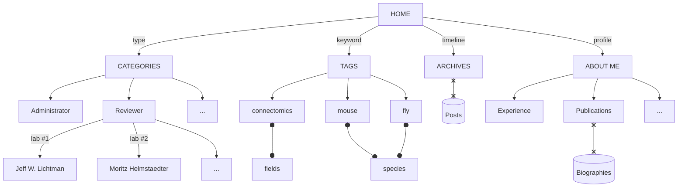

> If you feel confuse about post-centered theme, please follow this guidelines.  
I would like to give you a brief description about the architecture of my site.  
To visit my profile page, please check left sidebar and click my photo or "[About Me](https://haozhai.site/about/)".

## Holistic Architecture

## Left Sidebar

### My Photo

with my name and a brief introduction, is linked to my profile page.

### Five Tabs

- [HOME](https://haozhai.site): a overall presentation of **pinned** posts and recent posts. 
- [CATEGORIES](https://haozhai.site/categories/): a collection of different types.
  - [Administrator](https://haozhai.site/categories/administrator/)
  - [Reviewer](https://haozhai.site/categories/reviewer/)
    - [Jeff W. Lichtman](https://haozhai.site/categories/jeff-w-lichtman/)
    - [Moritz Helmstaedter](https://haozhai.site/categories/moritz-helmstaedter/)
    - ...
  - [Investigator](https://haozhai.site/categories/investigator/)
  - [Researcher](https://haozhai.site/categories/researcher/)
  - [Programmer](https://haozhai.site/categories/programmer/)
  - ...
- [TAGS](https://haozhai.site/tags/): a collection of various key words.
  - fields: [connectomics](https://haozhai.site/tags/connectomics/), ...
  - species: [mouse](https://haozhai.site/tags/mouse/), ...
  - ...
- [ARCHIVES](https://haozhai.site/archives/): a timeline presentation of all posts. 
- [ABOUT ME](https://haozhai.site/about/): 
my research **experience**, **interests**, **publications** and other related information 
(e.g., useful links and open resources).

### Four Contacts

- *light/dark theme switcher*: automatically follow your system.
- e-mail: both work e-mail and github e-mail are used.
- media
  - [GitHub](https://github.com/JackieZhai): all repos of my published works.
  - [Twitter](https://twitter.com/zhaihao2020): major social media I am using.
  - [YouTube](https://www.youtube.com/@haozhai): all videos or demos of my published works.

## Right Sidebar

- Recent Posts
- Trending Tags
- Contents: use "#" to navigate headlines after urls 
(e.g., [.../#right-sidebar](https://haozhai.site/posts/guidelines-for-my/#right-sidebar)).

## Header

- Navigator
- Search Box
- Between Title and Content
  - post time
  - update time
  - author
  - views: based on Google Analytics.
  - reading time: based on the number of words.

## Footer

- License: most posts are [CC BY-NC-SA 4.0](https://creativecommons.org/licenses/by-nc-sa/4.0/).
- Share
  - media: Twitter, Telegram and Weibo.
  - copy link
- Comment